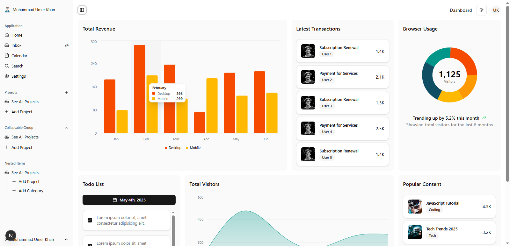
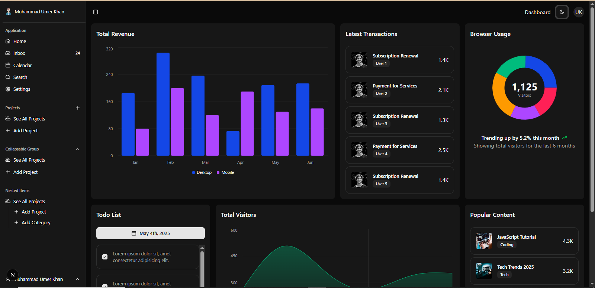

# Dashboard UI

A modern and responsive Dashboard UI built with **Next.js** and **ShadCN UI**. This project demonstrates clean design, reusable components, and dark/light mode support.


## Tech Stack

- [Next.js](https://nextjs.org/)
- [React](https://reactjs.org/)
- [ShadCN UI](https://ui.shadcn.dev/)
- [Tailwind CSS](https://tailwindcss.com/)
- [TypeScript](https://www.typescriptlang.org/) 

## Screenshots


| Light Mode | Dark Mode |
|------------|-----------|
|  |  |

## Getting Started

1. **Clone the repo**
   ```bash
   git clone https://github.com/UmerKhan-18/Dashboard-UI.git
   ```
2. **Install Dependencies**
   ```bash   
   npm install
   ```
3. **Run the development server**
   ```bash
   npm run dev
   ```
4. **Open http://localhost:3000 in your browser .**